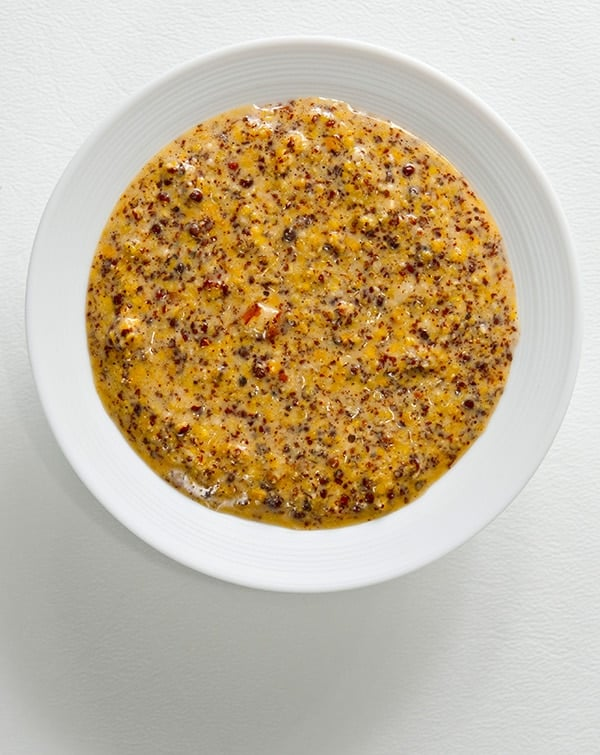

**Nathan’s Homemade Mustard**

**Ingredients:**

- [ ] 62g brown mustard seeds
- [ ] 62g yellow mustard seeds
- [ ] 115g Riesling or another white wine
- [ ] 70g white vinegar 
- [ ] 100g cider vinegar 
- [ ] 22g salt (not iodized)
- [ ] 26g brown sugar
- [ ] Optional - Horseradish paste, follow your heart (I do ~2Tbsp, which is too much for most people)
- [ ] Optional - Garlic cloves, ~5 pickled cloves is about right for me

**Instructions:**

- [ ] Combine seeds and liquids and soak for 8 - 24 hours, covered
- [ ] Set aside about a half cup soaked seeds
- [ ] Blend/process the rest of the soaked seeds and the salt, sugar, and optional ingredients until it reaches desired consistency
- [ ] Stir whole seeds back in and put in in an airtight glass container
- [ ] Let sit on counter 1-3 days to let flavors develop, then refrigerate

**Notes:**
- [ ] For the liquids, you can swap and adjust the wines and vinegars to your taste and dial in your desired flavors and acidity levels. Use good wines and vinegars you like. I like Apple cider vinegar but it’s too much on its own for my taste, which is why I dial it back by substituting white vinegar. 
- [ ] For the horseradish, use only pickled horseradish paste and not prepared horseradish that contains mayo or creams.
- [ ] Should last 6 months in the fridge
- [ ] I read and watched several online recipes and most closely followed this one. I also converted everything to weights for accuracy. 
https://youtu.be/ZnbVubOmN4I?si=zqpxpeULhg8eKWA-

